# Adopet API
API para o site adopet.

## Descrição
Api para o site adopet onde pode registrar animais e em qual abrigo esta cadastrar abrigos/ONGs se registrar com tutor para encontrar um pet novo ou não e adotar.

## Tecnologias
- Java 17
- Mysql
- Spring framework
- Spring Boot
- Hibernate
- Lombok
- SpringDoc
- Validation
- Spring Security

## Diagrama de Classes (Domínio da API)

```mermaid
classDiagram
    class Abrigo {
        Long id
        String email
        String telefone
        String nome
        List~Pet~ pets
        +Abrigo(AbrigoDtoReq dto)
        +void createOrUpdate(AbrigoDtoReq dto)
    }
    class Adocao {
        Long id
        Pet animal
        Tutor tutor
        LocalDate data
        +Adocao(AdocaoDtoReq dto, PetRepository petRepository, TutorRepository tutorRepository)
        +void createOrUpdate(AdocaoDtoReq dto, PetRepository petRepository, TutorRepository tutorRepository)
    }
    class Login {
        Long id
        String usuario
        String email
        String senha
        Tipo tipo
        +Login(CadastroDto dto, String senha, String tipo)
        +Collection~GrantedAuthority~ getAuthorities()
        +String getPassword()
        +String getUsername()
        +boolean isAccountNonExpired()
        +boolean isAccountNonLocked()
        +boolean isCredentialsNonExpired()
        +boolean isEnabled()
    }
    class Pet {
        Long id
        String nome
        String descricao
        boolean adotado
        String idade
        String endereco
        String imagem
        Abrigo abrigo
        List~Adocao~ adocoes
        +Pet(PetDtoReq dto, AbrigoRepository repository)
        +void createOrUpdate(PetDtoReq dto, AbrigoRepository repository)
        +void adotar()
    }
    class Tipo {
        <<enumeration>>
        TUTOR
        ABRIGO
    }
    class Tutor {
        Long id
        String fotoDePerfil
        String nome
        String telefone
        String cidade
        String sobre
        List~Adocao~ adocoes
        +Tutor(TutorDtoReq dto)
        +void createOrUpdate(TutorDtoReq dto)
    }

    Abrigo "1" --> "0..*" Pet
    Pet "1" --> "0..*" Adocao
    Tutor "1" --> "0..*" Adocao
    Adocao --> PclassDiagram
    class Abrigo {
        Long id
        String email
        String telefone
        String nome
        List~Pet~ pets
        +Abrigo(AbrigoDtoReq dto)
        +void createOrUpdate(AbrigoDtoReq dto)
    }
    
    class Adocao {
        Long id
        Pet animal
        Tutor tutor
        LocalDate data
        +Adocao(AdocaoDtoReq dto, PetRepository petRepository, TutorRepository tutorRepository)
        +void createOrUpdate(AdocaoDtoReq dto, PetRepository petRepository, TutorRepository tutorRepository)
    }
    
    class Login {
        Long id
        String usuario
        String email
        String senha
        Tipo tipo
        +Login(CadastroDto dto, String senha, String tipo)
        +Collection~GrantedAuthority~ getAuthorities()
        +String getPassword()
        +String getUsername()
        +boolean isAccountNonExpired()
        +boolean isAccountNonLocked()
        +boolean isCredentialsNonExpired()
        +boolean isEnabled()
    }
    
    class Pet {
        Long id
        String nome
        String descricao
        boolean adotado
        String idade
        String endereco
        String imagem
        Abrigo abrigo
        List~Adocao~ adocoes
        +Pet(PetDtoReq dto, AbrigoRepository repository)
        +void createOrUpdate(PetDtoReq dto, AbrigoRepository repository)
        +void adotar()
    }
    
    class Tipo {
        <<enumeration>>
        TUTOR
        ABRIGO
    }
    
    class Tutor {
        Long id
        String fotoDePerfil
        String nome
        String telefone
        String cidade
        String sobre
        List~Adocao~ adocoes
        +Tutor(TutorDtoReq dto)
        +void createOrUpdate(TutorDtoReq dto)
    }

    Abrigo "1" --> "0..*" Pet : "tem"
    Pet "1" --> "0..*" Adocao : "adocao"
    Tutor "1" --> "0..*" Adocao : "realiza"
    Adocao --> Pet : "adota"
    Adocao --> Tutor : "adotado por"
    Login --> Tipo : "tem"
et
    Adocao --> Tutor
    Login --> Tipo

```

## Testes
Para testar a aplicação basta acessar esta URL:
https://adopet-api-adopet.up.railway.app/swagger-ui/index.html#/

## Contribuição

Contribuições são bem-vindas! Siga os passos abaixo:

1. Fork o repositório.
2. Crie uma nova branch (git checkout -b feature/nova-feature).
3. Commit suas alterações (git commit -m 'Adiciona nova feature').
4. Push para a branch (git push origin feature/nova-feature).
5. Abra um Pull Request.

